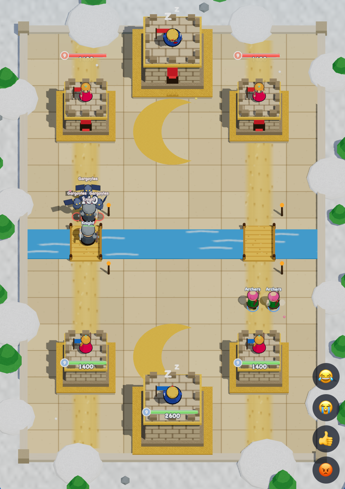
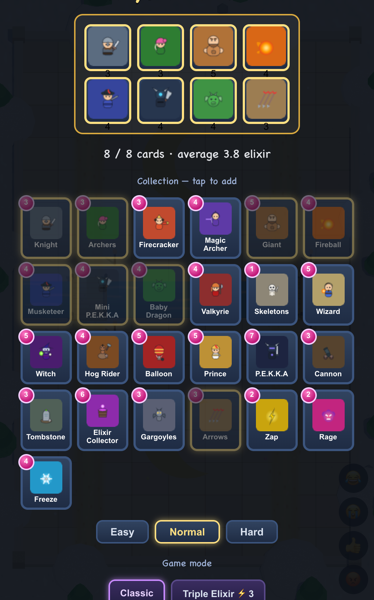

# 🏰 Build Your Own Battle Arena!
### A Kids' Guide to How This Game Works — and How **YOU** Can Make It Better

> A 3D tower-battle game made with code. This guide explains how it is built,
> shows you real pieces of the code, and gives you ideas (and ready-to-use AI
> prompts) so you can add your own cards, sounds, and arenas.
>
> **Who is this for?** Curious kids (around 6th grade) who want to see how a
> real video game is made — no experience needed.

---

## Slide 1 — What is this game? 🎮

Two players (or you vs. the computer) each defend **three towers**.
You drop **cards** — knights, dragons, wizards, giants — onto a battlefield
split by a **river** with two **bridges**.

- Your troops march toward the enemy and fight.
- You spend **elixir** (a purple energy that slowly refills) to play cards.
- The match lasts **3 minutes**. Knock down towers to earn **crowns**.
- Destroy the enemy **King Tower**, or have the most crowns when time runs out — **you win!** 👑

It's all **original art** made from simple 3D shapes (boxes, balls, cones) and
all sounds are **made by the computer** — no copying anyone else's pictures or music.



*The 3D battlefield — towers, a river, two bridges, and troops, all drawn by code.*

---

## Slide 2 — The Big Secret: a game has a "Brain" and a "Body" 🧠➕🦾

This is the **most important idea** in the whole game. Remember it!

| The Brain (the rules) | The Body (what you see & hear) |
|---|---|
| How much health a knight has | What the knight *looks* like |
| Who attacks whom | The sword swing animation |
| Who wins | The victory music |

**Why split them?** Think of a board game like chess:
- The **rules** of chess are the same whether you play with a wooden set, a glass set, or on a phone.
- The **pieces** can look like anything.

In our game, the **Brain** is code that just does math — it never draws anything.
The **Body** reads the Brain and draws pretty pictures. Keeping them separate
makes the game easier to fix, test, and grow. 🌱

---

## Slide 3 — What is it made with? 🛠️

| Tool | What it does | Kid-friendly meaning |
|---|---|---|
| **TypeScript** | The programming language | Like English, but for computers — and it labels everything so you make fewer mistakes |
| **Three.js** | Draws 3D graphics | The "art teacher" that turns numbers into 3D shapes on screen |
| **Web Audio** | Makes sounds | A tiny music machine built into your web browser |
| **Vite** | Runs the game | The "play button" that starts everything on your computer |
| **Vitest** | Checks the code | The "homework checker" that makes sure nothing is broken |

The whole game runs **inside a web browser** (like Chrome) — no app store needed!

---

## Slide 4 — The map of the project 🗺️

The code is split into folders, each with one job:

```
src/
├── game/        ← 🧠 THE BRAIN: rules, math, who-beats-who (no pictures!)
│    ├── cards.ts      every card's stats (the Knight, Giant, Dragon…)
│    ├── sim.ts        the "heartbeat" that moves the battle forward
│    ├── battle.ts     the battlefield, towers, and elixir
│    └── bot.ts        the computer opponent's thinking
│
├── render3d/    ← 🦾 THE BODY (eyes): turns the Brain into 3D pictures
│    ├── characters3d.ts   builds each character out of 3D shapes
│    └── scene3d.ts        the camera, lights, and the whole 3D world
│
├── audio/       ← 🦾 THE BODY (ears): makes all the sounds
├── net/         ← 🌐 lets two real people play over Wi-Fi
└── main.ts      ← 🔌 the glue that connects everything together
```

👉 Notice: the **game/** folder never draws or plays anything. That's the secret from Slide 2!

---

## Slide 5 — A card is just a list of facts 🃏

Open `src/game/cards.ts` and you'll find every card written as a simple
list of facts. Here is the **Knight**:

```typescript
knight: {
  name: "Knight",
  cost: 3,            // costs 3 elixir to play
  count: 1,           // you get 1 knight
  unit: unit({
    maxHp: 1400,      // health: how much damage it can take
    damage: 160,      // how hard it hits
    hitSpeed: 1.2,    // seconds between hits
    attackRange: 0.8, // very short = it must be close (melee)
    speed: "medium",  // how fast it walks
  }),
}
```

That's it! A card is **just numbers and words**. Change `maxHp: 1400` to
`maxHp: 5000` and suddenly the Knight is a super-tank. 💪



*The card collection — every card lives here, including the Firecracker and Magic Archer we added.*

---

## Slide 6 — The heartbeat of the battle 💓

A video game is like a **flipbook**: it draws a slightly different picture
many times every second, and your eyes see movement.

Each "page" is called a **tick**. About 30 times per second, the Brain runs
this `tick` function in `src/game/sim.ts`:

```typescript
export function tick(state, dt) {
  // 1. Give both players a little more elixir
  // 2. For every unit: find a target, walk toward it, attack
  // 3. Move the arrows and fireballs that are flying
  // 4. Remove anything whose health hit zero
  // 5. Check: did someone win?
}
```

`dt` means **"delta time"** — how much time passed since the last tick.
Using `dt` keeps the game running at the same speed on a fast computer **and**
a slow one. ⏱️

---

## Slide 7 — How does a troop know who to fight? 🎯

Every tick, each troop asks two questions:

1. **"Who is my target?"** (usually the nearest enemy or tower)
2. **"Am I close enough to hit it?"**
   - **Yes** → attack! 💥
   - **No** → take a step closer. 🚶

We recently added a smart rule called **target persistence**: once a troop
is *already fighting* something, it **keeps** fighting it — even if a new
enemy pops up closer. (Before, troops were easily distracted, like a puppy
chasing every squirrel! 🐶)

```typescript
// If I'm already in range of my target, stay on it.
if (current && gap(e, current) <= e.attackRange) {
  return current; // don't get distracted!
}
```

---

## Slide 8 — Two cards we built, step by step ✨

We added two brand-new cards. Each one needed a **special new ability** that
the game didn't have before:

### 🧨 Firecracker
- Shoots a firework that **splashes** (hits several enemies).
- **Recoils** — she hops *backward* after every shot, like a real firework's kick!

### 🏹 Magic Archer
- Shoots one arrow that **pierces** — it flies in a straight line and hits
  **every** enemy it passes through, not just the first one.

Here's the Firecracker's card (notice `recoil` and `splashRadius`):

```typescript
firecracker: {
  name: "Firecracker",
  cost: 3,
  unit: unit({
    maxHp: 140,         // very weak — protect her!
    damage: 130,
    hitSpeed: 3,        // slow reload
    attackRange: 6,     // shoots from far away
    speed: "fast",
    targetsAir: true,   // can hit flying enemies
    splashRadius: 1.4,  // sparks spread out
    recoil: 2,          // hops back 2 tiles after firing 🆕
  }),
}
```

---

## Slide 9 — The most important habit: test FIRST! ✅

Real programmers use a trick called **Test-Driven Development (TDD)**.
The order is: **Red → Green → Refactor**.

1. 🔴 **Red:** First, write a little test that says what you *want*. Run it —
   it **fails** (red), because you haven't built it yet. That's good!
2. 🟢 **Green:** Now write the simplest code to make the test **pass** (green).
3. 🔵 **Refactor:** Clean up your code to make it neat, while the test stays green.

Here's a real test for the Firecracker:

```typescript
it("the firecracker hops backward after firing", () => {
  // put a firecracker and an enemy on the map...
  const startY = firecracker.y;
  run(battle, 1.5); // let 1.5 seconds pass
  // ...and check she moved backward!
  expect(firecracker.y).toBeGreaterThan(startY + 1);
});
```

Writing the test first is like deciding the **rules of a game before you play**,
so everyone agrees what "winning" means. This game has **240+** of these tiny
checks running all the time! 🎉

---

## Slide 10 — How to run the game on your computer 🚀

You only need three commands in the terminal:

```sh
npm install      # download the toolbox (do this once)
npm run dev      # start the game → open http://localhost:3101
npm test         # run all the homework checks
```

Want to play a friend on the same Wi-Fi? Run:

```sh
npm run play     # prints a link to share with a friend's device
```

---

## Slide 11 — Coding with an AI helper 🤖

You can ask an AI assistant (like Claude Code) to help you build new things.
The secret is to **describe exactly what you want**, like giving directions to
a robot. Here are real prompts you can copy and try:

**🃏 Add a new card**
> "Add a new card called **Lava Hound** that flies, has 3000 health, attacks
> only buildings, and moves slowly. When it dies, make it explode into 6 small
> lava pups. Follow the same style as the other cards, and write a test first."

**🎨 Change how something looks**
> "Change the arena floor from sandy stone to green grass with flowers."

**✨ Add a new ability**
> "Make the Wizard's fireball leave a small ring of fire on the ground for 3
> seconds that hurts enemies who walk through it."

**🔊 Add a sound**
> "Play a cheerful trumpet sound when I destroy an enemy tower."

**💡 Tip:** Always ask the AI to **write a test first** and to **keep the Brain
and the Body separate** (Slide 2). That's how the pros do it!

---

## Slide 12 — Future enhancements: YOUR turn! 🌟

The game is just the beginning. Here are ideas to make it even cooler.
Pick one that excites you!

**🟢 Easier (great first projects)**
- Invent **3 new cards** with your own names and stats.
- Make a **new arena theme**: lava, ice, space, or underwater.
- Add **victory and defeat sounds** or background music.
- Give a card a **rainbow trail** when it walks.

**🟡 Medium (a fun challenge)**
- Add a **new spell**, like a tornado that pulls enemies together.
- Create a **"double trouble" mode** where every card spawns twice.
- Make the computer opponent **smarter** at defending.
- Add a **card collection screen** that shows all the cards you've unlocked.

**🔴 Harder (for future game developers!)**
- Add **emotes** so players can send funny faces during battle.
- Build a **leaderboard** that remembers high scores.
- Turn it into a **phone app** so you can play on a tablet.
- Design a **3-player or team battle** mode.

---

## Slide 13 — Why this is awesome to learn 🧗

Building a game teaches you skills that work **everywhere**:

- 🧠 **Problem-solving** — breaking a big dream into small steps.
- 🧩 **Logic** — "if this, then that."
- 🔢 **Math** — distance, speed, time, and angles (yes, the stuff in school!).
- 🎨 **Creativity** — designing characters and worlds.
- 🤝 **Teamwork** — sharing code and ideas, just like real game studios.

Every professional game — Minecraft, Roblox, Clash Royale — started with
someone writing their **first line of code**, exactly like you can today.

---

## Slide 14 — You can do this! 💪

> "Everybody in this country should learn to program a computer, because it
> teaches you how to think." — *Steve Jobs*

You don't have to understand everything at once. Real developers learn one
small piece at a time. Start by:

1. **Running** the game (Slide 10).
2. **Changing one number** in a card and seeing what happens.
3. **Adding one new card** with an AI helper (Slide 11).
4. **Dreaming up** your own feature (Slide 12).

The most important rule: **have fun and stay curious.** 🚀

**Now go build something amazing!**

---

### 📚 Quick Reference

| I want to… | Open this file |
|---|---|
| Change a card's stats | `src/game/cards.ts` |
| Change the battle rules | `src/game/sim.ts` |
| Change how a character looks | `src/render3d/characters3d.ts` |
| Change sounds | `src/audio/sound.ts` |
| Make the computer smarter | `src/game/bot.ts` |

*Made with TypeScript + Three.js. All art and sound are original. Have fun!* 🎮
